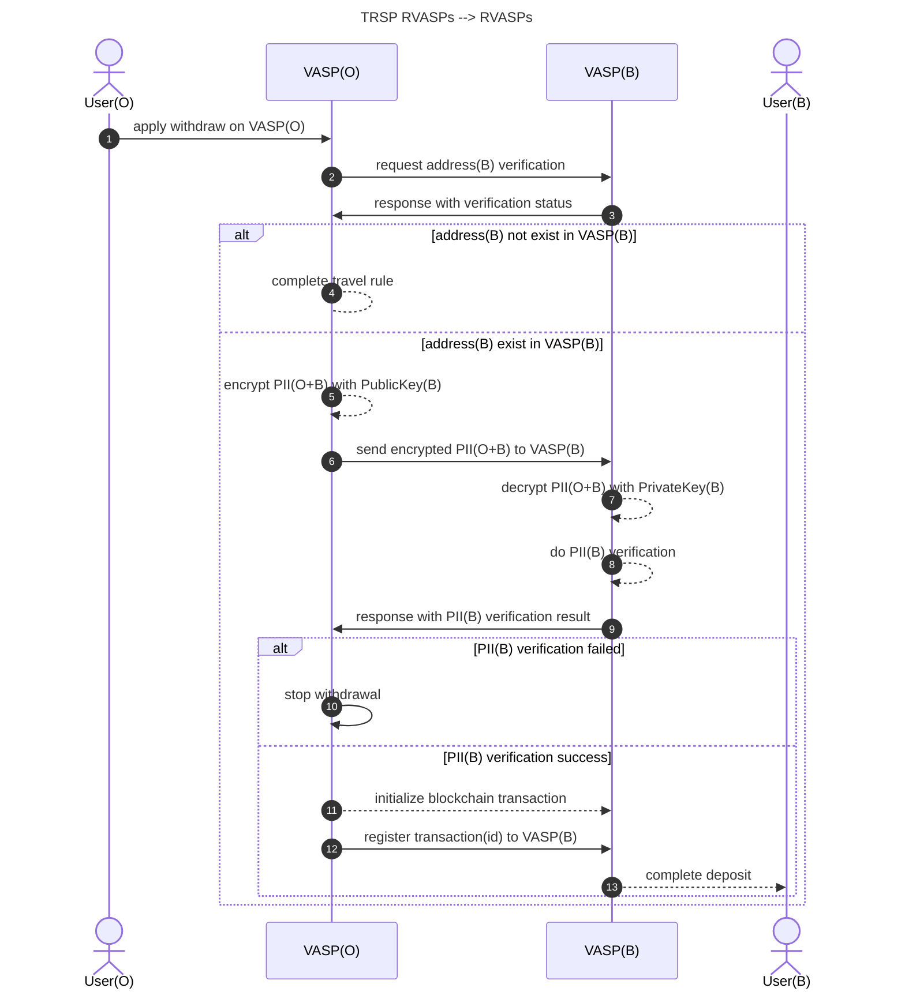
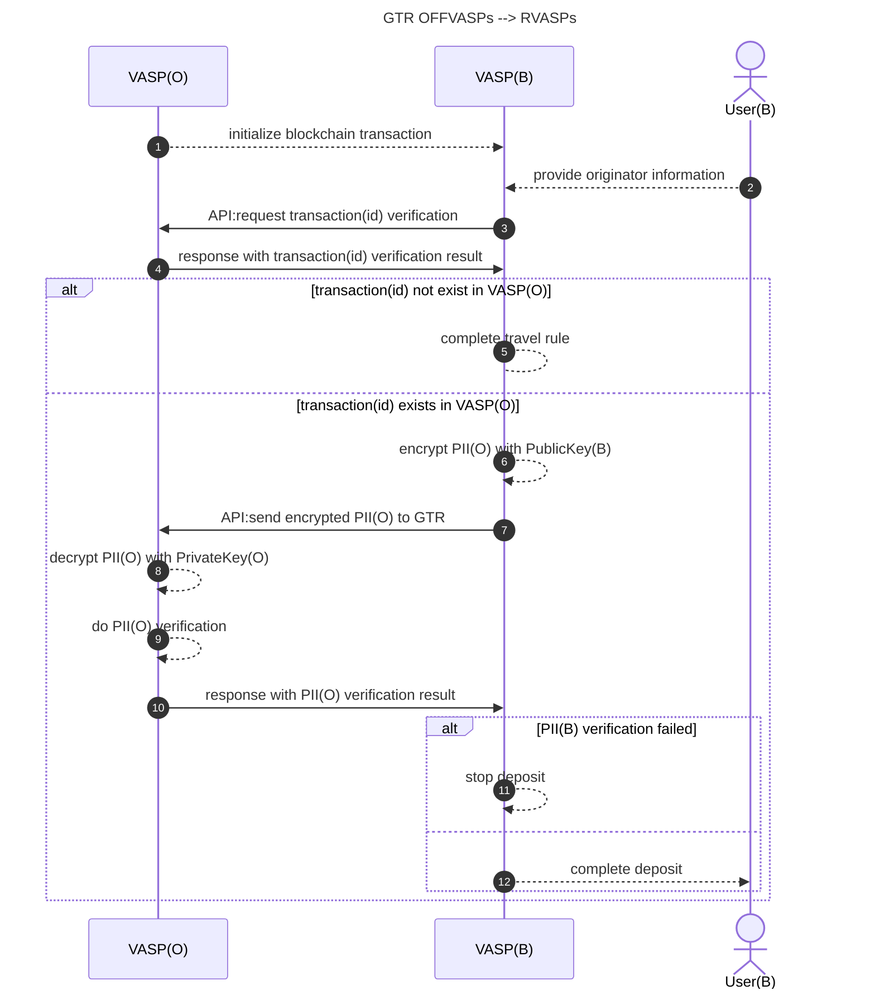

# **Travel Rule Verification and Interaction Protocol (TRVIP)**

## **1. Introduction**

The Travel Rule Verification and Interaction Protocol (TRVIP) is designed to facilitate compliant, secure, and
standardized information exchange between Virtual Asset Service Providers (VASPs) to meet regulatory requirements. This
protocol ensures the transmission of originator and beneficiary information while maintaining data integrity, privacy,
and security.

## **2. Terminology**

- **VA:** Virtual Asset.
- **VASP:** Virtual Asset Service Provider.
- **User:** User of VASP
- **TRSP:** Travel Rule Service Provider.
- **Originator VASP (VASP(O))**: The VASP initiating the transaction and sharing user identity information.
- **Beneficiary VASP (VASP(B))**: The VASP receiving the transaction and verifying the identity information.
- **Travel Rule Data (TRD)**: The structured data containing required identity and transaction details.
- **TRVID (Travel Rule Verification ID)**: A unique identifier assigned to each verification request.
- **PII (Personally Identifiable Information)**: Sensitive user information exchanged securely.
- **TF:** Terrorist Financing.

## **3. Regulated VASP to Regulated VASP**

TRVIP follows a structured multistep process where the **Originator VASP** communicates with the **Beneficiary VASP**
through **TRSP** to ensure compliance.



### **3.1 Get counterparty VASP information**

#### **3.1.1 User Initiates a Withdrawal**

**Step 1**, The user provides beneficiary information, including the recipient’s network and PII information.  
network information including network name, ticker name, tag, address;
PII information including user name(first name and last name), date of birth, etc.

### **3.2 Address verification**

#### **3.2.1 VASP(O) Requests Address Verification**

**Step 2**, VASP(O) requests address(B) verification from VASP(B).  
**Step 3**, VASP(B) responds to VASP(O) with the verification status of address(B).

#### **3.2.2 Handling Address Verification Results**

**Case 1**: If address(B) **does not exist** in VASP(B),  
**Step 4**, VASP(O) completes the travel rule process.  
**Case 2**: If address(B) **exists** in VASP(B),  
Move to step PII verification

### **3.3 PII Verification**

#### **3.3.1 VASP(O) Requests PII Verification**

**Step 5**, VASP(O) encrypts PII(O+B) using PublicKey(B).  
**Step 6**, VASP(O) sends the encrypted PII(O+B) to VASP(B).  
**Step 7**, VASP(B) decrypts PII(O+B) using PrivateKey(B).  
**Step 8**, VASP(B) performs internal PII(B) verification.  
**Step 9**, VASP(B) responds to VASP(O) with the PII(B) verification result.

#### **3.1.2 Handling PII Verification Results**

**Case 1**: If **PII(B) verification fails**,  
**Step 10**, VASP(O) stops the withdrawal process.

**Case 2**: If **PII(B) verification succeeds**,  
Move to VASP(O) initialize blockchain transaction to VASP(B)

### 3.4 **VASP(O) initialize blockchain transaction to VASP(B)**

**Step 11**, VASP(O) initializes the blockchain transaction.

### 3.5 **Blockchain transaction and travel rule registration**

**Step 12**, VASP(O) registers the transaction(ID) with VASP(B).  
**Step 13**, VASP(B) completes the deposit process for User(B).

## **4. Offshore VASP to Regulated VASP**



### **4.1 Blockchain Transaction Initialization**

**Step 1**, VASP(O) initializes the blockchain transaction.

### **4.2 User Provides Originator Information**

**Step 2**, User(B) provides originator information to VASP(B).
network information including network name, ticker name, tag, transaction(ID);
PII information including user name(first name and last name), date of birth, etc.

### **4.3 Transaction Verification**

#### **4.3.1 VASP(B) Requests Transaction Verification**

**Step 3**, VASP(B) sends an API request to VASP(O) to verify transaction(ID).  
**Step 4**, VASP(O) responds to VASP(B) with the transaction(ID) verification result.

#### **4.3.2 Handling Transaction Verification Results**

**Case 1**: If transaction(ID) **does not exist** in VASP(O),  
**Step 5**, VASP(B) completes the travel rule process.  
**Case 2**: If transaction(ID) **exists** in VASP(O)  
Move to step PII verification

### **4.4 VASP(B) Requests PII Verification**

#### **4.4.1 VASP(B) Requests PII Verification**

**Step 6**, VASP(B) encrypts PII(O) using PublicKey(B).  
**Step 7**, VASP(B) sends the encrypted PII(O) to VASP(O).  
**Step 8**, VASP(O) decrypts PII(O) using PrivateKey(O).  
**Step 9**, VASP(O) performs internal PII(O) verification.  
**Step 10**, VASP(O) responds to VASP(B) with the PII(O) verification result.

#### **4.4.2 Handling PII Verification Results**

**Case 1**: If **PII(B) verification fails**,  
**Step 11**, VASP(B) stops the deposit process.  
**Case 2**: If **PII(B) verification succeeds**  
**Step 12**, VASP(B) completes the deposit process for User(B).

## **5. Message Formats**

### **5.1 Address Verification**

#### **5.1.1 Address Verification Request**

| Property            | Type   | Required | Description                                                                    |
|---------------------|--------|----------|--------------------------------------------------------------------------------|
| address             | String | No       | The blockchain address involved in the transaction.                            |
| initiatorPublicKey  | String | No       | The public key of the transaction initiator.                                   |
| network             | String | Yes      | The blockchain network where the transaction occurs (e.g., Bitcoin, Ethereum). |
| requestId           | String | Yes      | A unique identifier for tracking the Travel Rule request.                      |
| tag                 | String | No       | Additional metadata or identifier related to the transaction.                  |
| targetVaspCode      | String | No       | The identifier of the target VASP (Virtual Asset Service Provider).            |
| targetVaspPublicKey | String | No       | The public key of the target VASP.                                             |
| ticker              | String | Yes      | The asset ticker symbol (e.g., BTC, ETH) involved in the transaction.          |
| txId                | String | No       | The transaction ID on the blockchain.                                          |

#### **Example**

```json
{
  "ticker": "string",
  "address": "string",
  "requestId": "string",
  "txId": "string",
  "initiatorPublicKey": "string",
  "tag": "string",
  "network": "string",
  "targetVaspCode": "string",
  "targetVaspPublicKey": "string"
}
```

#### **5.1.2 Address Verification Response**

| Property      | Type    | Description                                                |
|---------------|---------|------------------------------------------------------------|
| success       | Boolean | Indicates whether the verification process was successful. |
| verifyMessage | String  | A message providing details about the verification result. |
| verifyStatus  | Integer | A status code representing the verification outcome.       |

#### **Example**

```json
{
  "verifyStatus": 0,
  "success": true,
  "verifyMessage": "string"
}
```

### **4.2 Transaction Verification**

### **4.2.1 Transaction Verification Request**

| Property            | Type   | Required | Description                                                                    |
|---------------------|--------|----------|--------------------------------------------------------------------------------|
| address             | String | No       | The blockchain address involved in the transaction.                            |
| initiatorPublicKey  | String | Yes      | The public key of the transaction initiator.                                   |
| network             | String | Yes      | The blockchain network where the transaction occurs (e.g., Bitcoin, Ethereum). |
| requestId           | String | Yes      | A unique identifier for tracking the Travel Rule request.                      |
| tag                 | String | No       | Additional metadata or identifier related to the transaction.                  |
| targetVaspCode      | String | Yes      | The identifier of the target VASP (Virtual Asset Service Provider).            |
| targetVaspPublicKey | String | Yes      | The public key of the target VASP.                                             |
| ticker              | String | Yes      | The asset ticker symbol (e.g., BTC, ETH) involved in the transaction.          |
| txId                | String | Yes      | The transaction ID on the blockchain.                                          |

#### **Example**

```json
{
  "ticker": "string",
  "address": "string",
  "requestId": "string",
  "txId": "string",
  "initiatorPublicKey": "string",
  "tag": "string",
  "network": "string",
  "targetVaspCode": "string",
  "targetVaspPublicKey": "string"
}
```

### **5.2.2 Transaction Verification Response**

| Property      | Type    | Description                                                |
|---------------|---------|------------------------------------------------------------|
| success       | Boolean | Indicates whether the verification process was successful. |
| verifyMessage | String  | A message providing details about the verification result. |
| verifyStatus  | Integer | A status code representing the verification outcome.       |

#### **Example**

```json
{
  "verifyStatus": 0,
  "success": true,
  "verifyMessage": "string"
}
```

### **5.3 PII Verification**

### **5.3.1 PII Verification Request**

| Property            | Type          | Required | Description                                                                               |
|---------------------|---------------|----------|-------------------------------------------------------------------------------------------|
| amount              | String        | Yes      | The transaction amount in the specified fiat or cryptocurrency.                           |
| emptyPiiSchema      | String        | No       | An optional schema indicating whether personally identifiable information (PII) is empty. |
| encryptedPayload    | String        | Yes      | The encrypted data containing transaction details.                                        |
| expectVerifyFields  | Array<String> | No       | A list of expected fields to be verified during the transaction process.                  |
| fiatName            | String        | Yes      | The name of the fiat currency used in the transaction (e.g., USD, EUR).                   |
| fiatPrice           | String        | Yes      | The fiat currency equivalent of the transaction amount.                                   |
| initiatorPublicKey  | String        | No       | The public key of the transaction initiator.                                              |
| lawThresholdEnabled | Boolean       | No       | Indicates whether the legal threshold check is enabled.                                   |
| piiSpecVersion      | String        | No       | The version of the Personally Identifiable Information (PII) specification used.          |
| requestId           | String        | Yes      | A unique identifier for tracking the Travel Rule request.                                 |
| secretType          | Integer       | Yes      | The type of secret used for encryption or verification.                                   |
| targetVaspCode      | String        | Yes      | The identifier of the target VASP (Virtual Asset Service Provider).                       |
| targetVaspPublicKey | String        | No       | The public key of the target VASP.                                                        |
| txId                | String        | No       | The transaction ID on the blockchain.                                                     |

#### **Example**

```json
{
  "piiSpecVersion": "string",
  "amount": "string",
  "encryptedPayload": "string",
  "lawThresholdEnabled": true,
  "emptyPiiSchema": "string",
  "txId": "string",
  "targetVaspCode": "string",
  "fiatName": "string",
  "requestId": "string",
  "secretType": 0,
  "fiatPrice": "string",
  "initiatorPublicKey": "string",
  "expectVerifyFields": [
    "string"
  ],
  "targetVaspPublicKey": "string"
}
```

### **5.3.2 PII Verification Response**

| Property | Type   | Description                                                 |
|----------|--------|-------------------------------------------------------------|
| data     | Object | The main object containing Travel Rule transaction details. |

#### **data Object Properties**

| Property             | Type    | Description                                                                     |
|----------------------|---------|---------------------------------------------------------------------------------|
| beneficiaryPublicKey | String  | The public key of the transaction beneficiary.                                  |
| emptyPiiSchema       | String  | A schema indicating whether personally identifiable information (PII) is empty. |
| encryptedPayload     | String  | The encrypted data containing transaction details.                              |
| hashSalt             | String  | A cryptographic salt used for data integrity verification.                      |
| initiatorPublicKey   | String  | The public key of the transaction initiator.                                    |
| originatorPublicKey  | String  | The public key of the originator (sender).                                      |
| receiverPublicKey    | String  | The public key of the receiver.                                                 |
| requestId            | String  | A unique identifier for tracking the Travel Rule request.                       |
| secretType           | Integer | The type of secret used for encryption or verification.                         |
| travelruleId         | String  | A unique identifier for the Travel Rule transaction.                            |
| verifyFields         | Array<> | An array of verification details related to the transaction.                    |

#### **verifyFields Array Properties**

| Property    | Type    | Description                                         |
|-------------|---------|-----------------------------------------------------|
| [*].message | String  | The verification message associated with the field. |
| [*].status  | Integer | The status code of the verification result.         |
| [*].type    | String  | The type of field being verified.                   |

#### **Verification Response Properties**

| Property      | Type    | Description                                                |
|---------------|---------|------------------------------------------------------------|
| success       | Boolean | Indicates whether the verification process was successful. |
| verifyMessage | String  | A message providing details about the verification result. |
| verifyStatus  | Integer | A status code representing the verification outcome.       |

#### **Example**

```json
{
  "data": {
    "hashSalt": "string",
    "encryptedPayload": "string",
    "verifyFields": [
      {
        "message": "string",
        "type": "string",
        "status": 0
      }
    ],
    "requestId": "string",
    "secretType": 0,
    "travelruleId": "string",
    "emptyPiiSchema": "string",
    "initiatorPublicKey": "string",
    "originatorPublicKey": "string",
    "beneficiaryPublicKey": "string",
    "receiverPublicKey": "string"
  },
  "verifyStatus": 0,
  "success": true,
  "verifyMessage": "string"
}
```

## **6. Security Considerations**

To ensure compliance and security, TRVIP implements:

### 6.1 **Authentication: TLS 1.3 for encrypted communication**

mTLS (mutual TLS) is an enhanced version of the TLS (Transport Layer Security) protocol that provides mutual
authentication between client and server. Unlike standard TLS, which only verifies the server’s identity, mTLS requires
both the client and the server to authenticate each other using certificates.

### 6.2 **Data Integrity**: Curve25519 for encrypted PII information

Curve25519 is an elliptic curve used in cryptography, primarily designed for public-key cryptography systems. It
provides high security, efficiency, and speed, making it a popular choice for protocols like TLS, VPNs, and Signal.
**Replay Attack Prevention**: Use of **Nonce** and unique **TRVID**.
**Privacy Protection**: Minimization of shared identity details to necessary regulatory requirements.

## **7. References**

- FATF Travel Rule Guidelines
    - https://www.fatf-gafi.org/content/dam/fatf-gafi/guidance/Updated-Guidance-VA-VASP.pdf.coredownload.inline.pdf
- RFC 8446 - TLS 1.3
    - https://www.rfc-editor.org/rfc/rfc8446?utm_source=chatgpt.com
- RFC 6979 - Deterministic ECDSA
    - https://www.rfc-editor.org/rfc/rfc7748
    - https://www.rfc-editor.org/rfc/rfc8031
- ISO/IEC 27001 - Information Security Standards
    - https://archive.org/download/iso27001/iso27001.pdf

