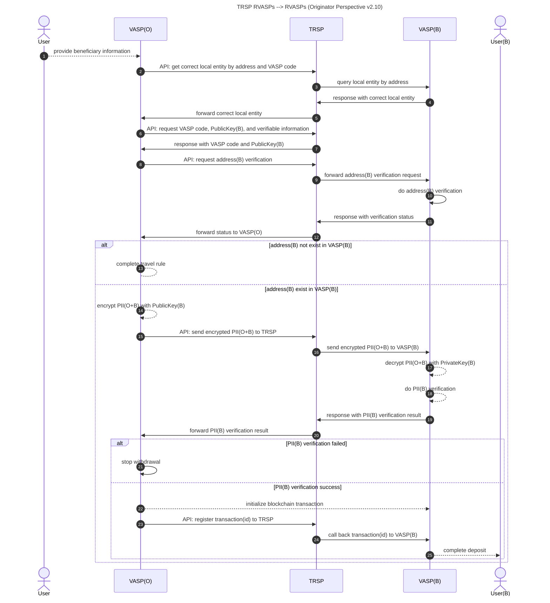

# **TRSPP-0001: Travel Rule Verification and Interaction Protocol (TRVIP)**

## **1. Introduction**
The Travel Rule Verification and Interaction Protocol (TRVIP) is designed to facilitate compliant, secure, and standardized information exchange between Virtual Asset Service Providers (VASPs) to meet regulatory requirements. This protocol ensures the transmission of originator and beneficiary information while maintaining data integrity, privacy, and security.

## **2. Terminology**
- **VA:** Virtual Asset.
- **VASP:** Virtual Asset Service Provider.
- **TRSP:** Travel Rule Service Provider.
- **Originator VASP (VASP(O))**: The VASP initiating the transaction and sharing user identity information.
- **Beneficiary VASP (VASP(B))**: The VASP receiving the transaction and verifying the identity information.
- **Travel Rule Data (TRD)**: The structured data containing required identity and transaction details.
- **TRVID (Travel Rule Verification ID)**: A unique identifier assigned to each verification request.
- **PII (Personally Identifiable Information)**: Sensitive user information exchanged securely.
- **TF:** Terrorist Financing.


## **3. Protocol Architecture**
TRVIP follows a structured multi-step process where the **Originator VASP** communicates with the **Beneficiary VASP** through **TRSP** to ensure compliance.



## **4. Message Formats**
### **4.1 TRD Request Message Format**
```
------------------------------------------------
| Field Name       | Type    | Length | Description                |
|------------------|--------|--------|----------------------------|
| Version         | uint8  | 1      | Protocol version           |
| TRVID           | string | 36     | Unique verification ID     |
| Originator ID   | string | Var    | Originator’s identity      |
| Beneficiary ID  | string | Var    | Beneficiary’s identity     |
| Transaction Hash| bytes  | 32     | SHA-256 of transaction     |
| Nonce           | uint64 | 8      | Random security value      |
------------------------------------------------
```

## **5. Security Considerations**
To ensure compliance and security, TRVIP implements:
- **Authentication**: TLS 1.3 for encrypted communication.
- **Data Integrity**: SHA-256 hashing to prevent data tampering.
- **Replay Attack Prevention**: Use of **Nonce** and unique **TRVID**.
- **Privacy Protection**: Minimization of shared identity details to necessary regulatory requirements.

## **6. References**
- FATF Travel Rule Guidelines
- RFC 8446 - TLS 1.3
- RFC 6979 - Deterministic ECDSA
- ISO/IEC 27001 - Information Security Standards

