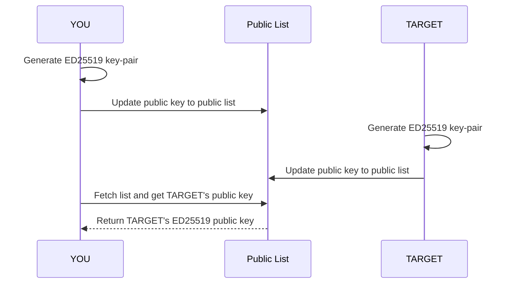
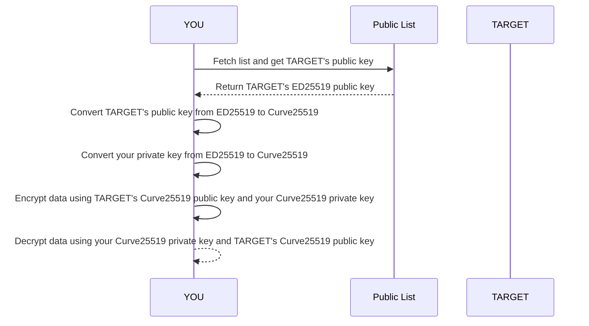
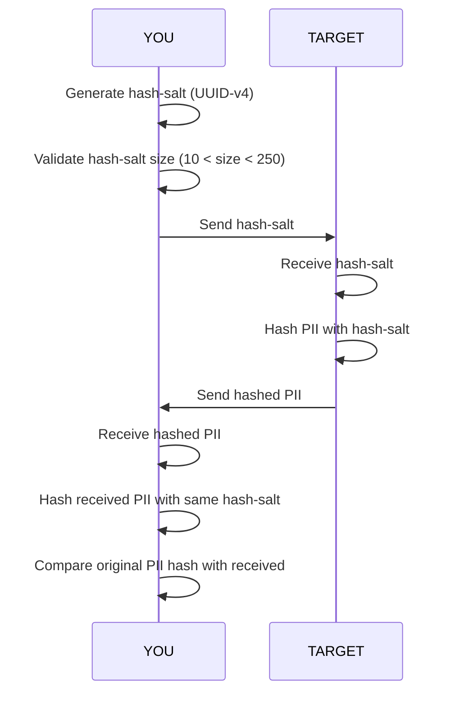

# **PII Protection and Cryptography**

## 1. Basic Methods for Protecting PII

Protecting Personally Identifiable Information (PII) is crucial to ensure privacy and security. Defines two different
scenario of cryptography:

- **[Verify/Exchange] Encryption**: Transforming information into a secret content, and using asymmetric encryption make
  sure it's not possible decrypt by middle person. this method can do KYC verification and PII exchange to opposite VASP
  according to travel-rule's law who need to follow it.
- **[Verify] Hashing**: The one way transforming and does not exist inverse function to revert the original content,
  when the user not agree to exchange PII, they choose this method to hide all PII content value, this method can only
  do KYC verification.

In the spec, we align to use `Curve25519` as an encryption algorithm and `Keccak256` as a hashing algorithm.

| Algorithm        | Curve25519 | Keccak256 |
|------------------|------------|-----------|
| Can Verify       | O          | O         |
| Can Exchange PII | O          | X         |

## 2. Using Asymmetric Encryption

### 2-1. Introduction to Curve25519

Curve25519 is a fast and secure elliptic curve used in public-key cryptography. It is widely adopted in various
cryptographic protocols, including TLS and SSH.

The encrypted data can only decrypt by the end user which is the opposite public key / private keyholder.

The encryption-key pair algorithm is based Elliptic-Curve Diffie-Hellman (ECDH) is a key agreement protocol that allows
two parties to securely exchange a secret key over an insecure channel. Curve25519 is often used with ECDH due to its
performance and security properties.

### 2-2. Public Key Exchange

Before doing encryption and decryption, the initiator VASP should know the target VASP's public key first, and then
using the public key to encrypt.

All the VASP should generate their key-pair by `ED25519` cipher, and providing `ED25519` public key to the table can see
in the public VASP list for everyone. So that you need to fetch the list and get the target VASP's public key.

### 2-3. Encryption and Decryption

To encrypt and decrypt the data, you should already get the target VASP's public key in ED25519 format, and then you're
starting to convert the `ED25519 Public Key` to `Curve25519 Public Key` and using this key with your own private key (
Also need to convert from `ED25519 Private Key` to `Curve25519 Private Key`) to make encryption and decryption.

## 3. Using Hashing Encode Data

### 3-1. Introduction to Hashing

Hashing is a fundamental concept in the protection of Personally Identifiable Information (PII). It involves converting
data into a fixed-size string of bytes, typically a "hash", that cannot be reversed to obtain the original data. In the
spec define the hashing algorithms is `keccak256`, which provides a strong method for data integrity and verification.

### 3-2. Salt exchange

To enhance security, a salt is added to the hashing process. A salt is a random value that is unique to each transaction
and is combined with the data before hashing. This ensures that even if two users have the same data, their hashes will
be different due to the unique salt.

All the hash salt must follow the requirements:

1. String size more than 10 but smaller than 250
2. Could directly use uuid-v4 or newer
3. Must not duplicate with previous

Salt exchange must change every time when hash the PII, the initiator should generate one hash-salt and send the
hash-salt to the target VASP.

