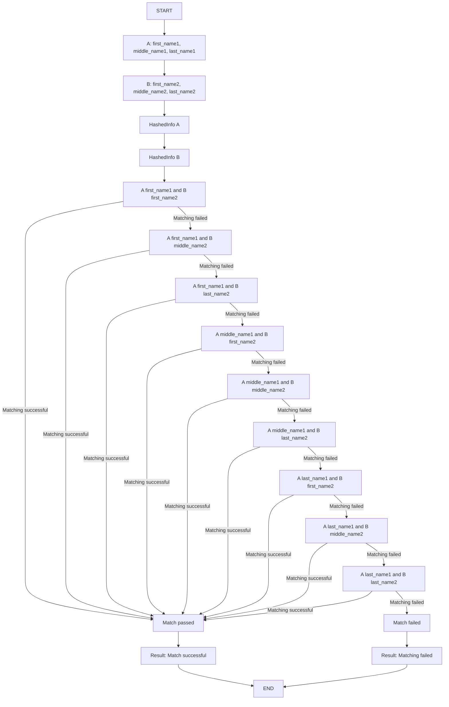
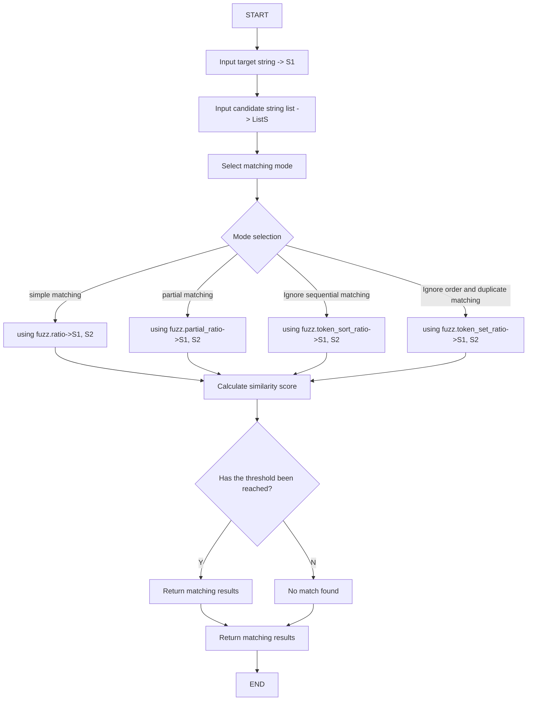
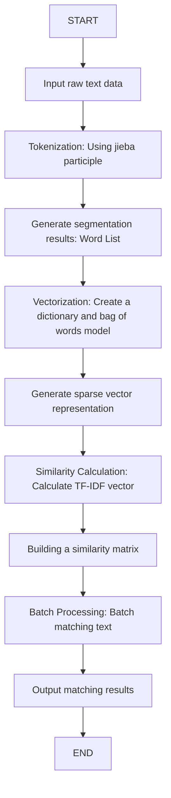

# User information matching mode

## Hash information text full matching mode

### **1. Introduction**

This mode is designed to match user information by comparing the full text of the user's hashed information. This method
ensures that every field of the user's information are compared, different fields can be matched cyclically according to
order.

## **2. Matching Process**

Hash string matching logic for usernames (first name, middle name, last name). According to the requirements, each name
field of a user (first name, middle name, last name) needs to be matched with three fields of another user (first name,
middle name, last name). As long as one of the matches is successful, it is judged as a successful match.



---

## Text similarity matching mode

### Matching Methods for User Information Data

### **1 Introduction**

In this document, we discuss three methods for fuzzy matching user information. The goal is
to match user information stored in two different datasets, where the names may have slight variations. The
methods include using the **Edit Distance algorithm**, the **FuzzyWuzzy library**, and the **Gensim library** for
large-scale fuzzy matching.

### **1.1 Edit Distance Algorithm**

### **1.1.1 Introduction**

The **Edit Distance** algorithm calculates the minimum number of operations (insertions, deletions, or substitutions)
required to transform one string into another. The smaller the edit distance, the more similar the two strings are.

### **1.1.2 Code Example**

```python
def edit_distance(word1: str, word2: str) -> int:
    n = len(word1)
    m = len(word2)

    # 有一个字符串为空串
    if n * m == 0:
        return n + m

    # DP 数组
    D = [[0] * (m + 1) for _ in range(n + 1)]

    # 边界状态初始化
    for i in range(n + 1):
        D[i][0] = i
    for j in range(m + 1):
        D[0][j] = j

    # 计算所有 DP 值
    for i in range(1, n + 1):
        for j in range(1, m + 1):
            left = D[i - 1][j] + 1
            down = D[i][j - 1] + 1
            left_down = D[i - 1][j - 1]
            if word1[i - 1] != word2[j - 1]:
                left_down += 1
            D[i][j] = min(left, down, left_down)

    return D[n][m]

```

### **1.2 FuzzyWuzzy Library**

### **1.2.1 Introduction**

**FuzzyWuzzy** is a Python library built on top of the Edit Distance algorithm. It provides a more efficient and
user-friendly way to calculate string similarity, with additional features like partial matching and token-based
matching.

- **Advantages**: Easy to understand and implement.
- **Disadvantages**: Computationally expensive for large datasets (e.g., 10,000+ records).
- **Use Case**: Suitable for small datasets or when simplicity is preferred.

### **1.2.2 Terminology**

- **fuzz.ratio(S1, S2)**: Computes the similarity score between two strings (0-100).
- **fuzz.partial_ratio(S1, S2)**: Checks if one string is a substring of another.
- **fuzz.token_sort_ratio(S1, S2)**: Ignores word order when comparing strings.
- **fuzz.token_set_ratio(S1, S2)**: Ignores both word order and frequency.
- **process.extract(S1, ListS, limit=n)**: Finds the top `n` matches from a list.
- **process.extractOne(S1, ListS)**: Returns the best match.

### **1.2.3 Matching Process**



### **1.2.4 Code Example**

```python
from fuzzywuzzy import fuzz, process

# Simple matching
print(fuzz.ratio("四川省", "四川省"))  # Output: 100
print(fuzz.ratio("四川省", "四川"))  # Output: 67

# Partial matching
print(fuzz.partial_ratio("四川省", "四川"))  # Output: 100

# Top matches
choices = ["四川省", "成都市", "西川", "四川"]
print(process.extract("四川", choices, limit=2))  # Output: [('四川', 100), ('四川省', 90)]
```

### **1.2.5 Use Case**

- Suitable for medium-sized datasets.
- Provides flexibility in matching criteria (e.g., partial matches, token-based matches).

### **1.3 Gensim Library for Large-Scale Fuzzy Matching**

### **1.3.1 Introduction**

For large datasets (e.g., 10,000+ records), **Gensim** is a powerful NLP library that can efficiently handle fuzzy
matching. It uses **TF-IDF** (Term Frequency-Inverse Document Frequency) to compute similarity between strings based on
their vector representations.

### **1.3.2 Matching Process**



### **1.3.3 Code Example**

```python
import pandas as pd
import jieba
from gensim import corpora, similarities, models

# Load data
data = pd.read_csv("配变.csv", encoding="gbk").astype(str)
find = pd.read_csv("用户名.csv", encoding="gbk").astype(str)

# Tokenization
data_split_word = data.name.apply(jieba.lcut)

# Create dictionary and corpus
dictionary = corpora.Dictionary(data_split_word.values)
data_corpus = data_split_word.apply(dictionary.doc2bow)

# Preprocess find data
trantab = str.maketrans("0123456789", "零一二三四五六七八九")
find_corpus = find.name.apply(lambda x: dictionary.doc2bow(jieba.lcut(x.translate(trantab))))

# Build similarity matrix
tfidf = models.TfidfModel(data_corpus.to_list())
index = similarities.SparseMatrixSimilarity(tfidf[data_corpus], num_features=len(dictionary))

# Get top 3 matches
result = []
for corpus in find_corpus.values:
    sim = pd.Series(index[corpus])
    result.append(data.name[sim.nlargest(3).index].values)
result = pd.DataFrame(result)
result.rename(columns=lambda i: f"匹配{i + 1}", inplace=True)
result = pd.concat([find, result], axis=1)

# Save results
result.to_excel('结果.xlsx')
```

### **1.3.4 Use Case**

- Ideal for large datasets (e.g., 10,000+ records).
- Provides high accuracy and efficiency.
- Suitable for batch processing.

### **2 Comparison of Methods**

| Method        | Dataset Size | Accuracy | Speed    | Complexity |
|---------------|--------------|----------|----------|------------|
| Edit Distance | Small        | High     | Slow     | Low        |
| FuzzyWuzzy    | Medium       | High     | Moderate | Low        |
| Gensim        | Large        | High     | Fast     | High       |

